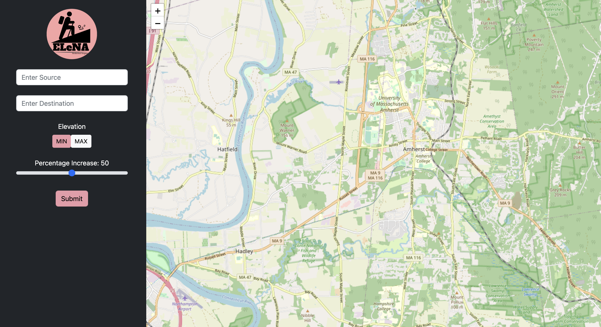
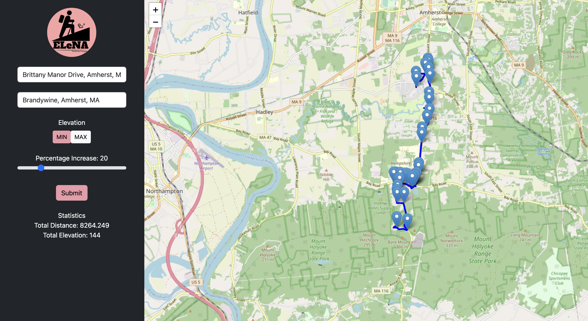

# EleNA 

EleNA: Elevation Based Navigation

What is EleNA?
EleNa (Elevation-based Navigation) is a web application that finds the best route between sorce and destination. EleNA web app can be used by hikers, bikers, and runners where they chosse a wide range of routes from easy hike to intense hike. We mainly focused on building the algorithm and obtaining the best results. Verified these routes in real-time world with multiple users. This is our final project for CS 520: Theory and practie of Software Engineering.  

How to Run:

Step-1 Install front-end dependencies and the server dependencies using the following two commands:

npm install
pip install -r requirements.txt

In EleNA_Server_App, run the Server backend using the following command:

python Server.py

In EleNA_Web_App, run the React client using the following command:

npm start

 

